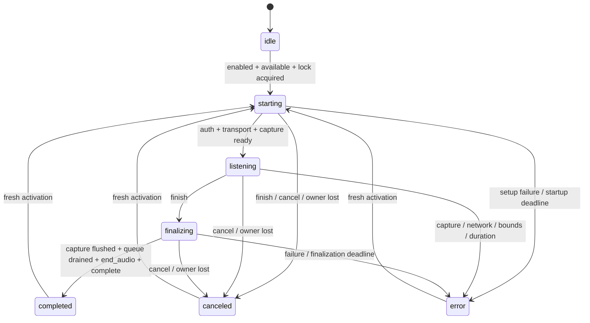

# Voice protocol v1

Voice support currently provides contracts, a session controller and a development-only
synthetic harness. Production activation is feature-disabled (`disabled`); no production adapters are available. There is no microphone capture,
transcription provider, editor insertion, shortcut, billing, or chat submission in this layer.

## Ownership and lifecycle

`VoiceController` is portable (`@beaver/agent-core/voice/controller`). Create exactly one
per application instance. In Zotero, `Zotero.Beaver.voice` owns it in the plugin realm.
Views can subscribe to the controller and use `projectVoice` to identify the one originating
window/output. React hooks and composer-specific locking/recording fields are deferred until
they have a UI consumer. Outputs are immutable `{kind: "composer" | "draft", id}` identities. Only
`ownsOutput` may apply transcript changes; other mounted views observe the busy state.
The controller does not write any editor or chat store.



Ready means setup succeeded, not that audio has flowed. `audioStarted` becomes true on the
first valid frame, including silence. Silence never implies denied permission. Finishing while
starting cancels: late permission/setup completion must require a new activation.
`start()` returns the allocated session ID, not a readiness guarantee. The snapshot is
authoritative even if a synchronous observer cancels that session before `start()` returns. Repeated
finish/cancel and old-session commands are harmless. Session IDs must be unique per activation.

The Zotero service accepts activation only from a focused window, canceling on its unload or top-level
blur, and removes those listeners on termination. Main-window cleanup also cancels explicitly.
Logout/account replacement revokes the session, including while authentication is unresolved;
a new account must not inherit an earlier activation. Hosts pass the known user ID to `start()`
so another window reporting the same account during setup does not revoke that activation.
The expected ID is required, and the resolved credentials must still match it.
Same-user token refresh does not notify
the controller of an identity change. Plugin shutdown disposes the service. Timers
use Gecko's system timer module so closing a window cannot disable a watchdog.
Permission setup that steals focus cancels activation; granting permission must not silently
start audio afterward. The user activates again once setup is complete.

## Adapter contract

Factories synchronously return an owned handle **before** asynchronous setup. Factory callbacks
must be associated with the supplied session. Capture `start()` emits `ready` with the negotiated
format and resolves; it may then emit frames. Transcription `start(credential)` must authenticate
and establish bounded transport capacity before resolving. Only then is capture created.
Capture/transcription factories and capability checks are constructor dependencies of the
service. Production leaves the feature disabled with unavailable adapters; a compile-time development branch
constructs the separate plugin-owned `DevelopmentVoiceHarness` with fake adapters. Voice has
its own package closure roots, independent of the agent-run protocol barrel.

Credentials are provided through an injected function, never imported from React into the plugin
bundle, included in a snapshot, or sent to a native helper.

`dispose()` is idempotent, including during setup. It synchronously revokes setup/callbacks,
stops capture, and initiates closing owned resources. Native adapters must ensure permission
results cannot restart audio after disposal, and must enforce bounded process termination,
independent control watchdogs, and parent-death cleanup. Their local IPC and kill/close details
belong in the adapter. The controller invalidates callbacks before invoking either disposal and
still disposes the other resource if one throws. Adapters must not silently reconnect or replay.

Capture `finish()` stops and flushes, resolving only after the final frame callback. No frames
may follow its resolution. Transcription `send(frame)` must resolve when bounded transport
capacity is available, not immediately after appending to an unbounded WebSocket buffer.
The controller drains frames serially; `finish(end_audio)` follows all sends. A separate
`complete` event acknowledges that all transcript finals were emitted. Resolving `finish()`
alone does not complete a session. Transport EOF before `complete` is `disconnected`.

## Envelopes, frames and ordering

Every event/control has `{version: 1, sessionId}`. IPC adapters validate unknown input, negotiate
versions, enforce payload bounds before decoding/allocating, and convert to these typed contracts.
A mismatched version fails the active session; callbacks belonging to another session are ignored.
The interfaces specify semantics, not a required HTTP/pipe/WebSocket serialization.

Audio is **16,000 Hz, mono, signed PCM16 little-endian**, `encoding: "pcm_s16le"`.
`VoiceFrame` carries `sequence` (zero-based contiguous), `sampleCount`, `format`, and `pcm`
(`Uint8Array`, exactly two bytes per sample). Frames normally contain 1,600 samples (100 ms).
Finish permits one shorter, nonempty last frame. Empty tails emit no frame. Gaps, duplicate
frames, wrong lengths/formats, and frames after a short tail are protocol errors. The controller
copies bytes synchronously so capture can reuse its buffer, and exposes normalized RMS levels.
`end_audio` includes the total `frameCount` and `sampleCount` for server-side validation.

Transcript events use a separate zero-based contiguous `sequence`. Duplicate/older sequence
numbers are ignored; gaps fail. Segments use contiguous zero-based numeric `segmentId`s.
Only one segment is provisional at a time. Each interim replaces its text. `segment_final`
commits once and advances the segment; subsequent updates to a committed segment are ignored.
Text concatenates exactly as delivered, so adapters supply punctuation and inter-segment spacing.
A segment final never ends recording. `complete` is valid only after end-of-audio, with no
unfinalized provisional text. Failed/canceled sessions discard provisional text and retain
committed text for explicit review, never successful submission.

`VoiceControl` defines `finish`, `cancel`, and `end_audio`. Native readiness, permission,
heartbeat, token/host validation and transport shutdown envelopes are adapter-specific.
A Windows pipe adapter can map readiness into `ready`, accumulate partial pipe reads into
bounded frames, flush the last samples before resolving `finish()`, and map device discontinuity
into the distinct `discontinuity` error. Control-pipe EOF must release its microphone even if
no audio callback arrives. A macOS adapter can express the same lifecycle over authenticated
loopback IPC without sharing Windows launch mechanics.

## Limits and errors

`VOICE_LIMITS` names the v1 client bounds. Backend/native adapters must also enforce their
corresponding bounds independently; client checks are not an authorization boundary.

| Limit | Value |
|---|---:|
| Frame samples / bytes | 1,600 / 3,200 |
| Queued bytes, including in-flight send | 160,000 (5 seconds) |
| Authentication + transport + capture startup | 30 seconds |
| Finish + flush + drain + completion | 10 seconds |
| Listening duration | 120 seconds |
| Retained transcript characters (UTF-16 code units) | 64,000 |
| Final segments | 1,000 |

Error payloads contain a named `code`, without provider messages, credentials, audio or text:
`disabled`, `unavailable`, `busy`, `unauthenticated`, `permission_denied`, `device_unavailable`,
`capture_failed`, `discontinuity`, `transcription_failed`, `disconnected`, `protocol_error`,
`overflow`, `startup_timeout`, `finalization_timeout`, `duration_limit`.
Activation rejection returns an error without replacing another session's state. Active-session
failure disposes resources and preserves committed text. Overflow is an error, never silent loss.
No audio or transcript is logged or persisted by this layer.

## Reproducible synthetic harness

The development harness uses a synthetic window owner; real-window focus and unload behavior are
covered separately by service tests. Start callers must supply the expected account ID before
credentials resolve.

Use a development build in a logged-in Zotero instance (desktop focus is not required). The endpoint is absent in production;
the handler also checks development mode. The harness starts disabled and can never open a microphone
or provider connection. Determine the instance's HTTP port from its worktree metadata or
`Zotero.Server.port`; do not assume the default port.

```sh
# Set VOICE_HTTP_PORT to the intended instance's actual port.
voice() {
  curl --fail -sS -X POST "http://127.0.0.1:$VOICE_HTTP_PORT/beaver/test/voice" \
    -H 'Content-Type: application/json' -d "$1"
}
voice '{"command":"enable","enabled":true}'
voice '{"command":"start"}'
voice '{"command":"state"}' # wait for listening
voice '{"command":"frame"}'
voice '{"command":"interim","segmentId":0,"text":"A short"}'
voice '{"command":"segment_final","segmentId":0,"text":"A short voice test."}'
voice '{"command":"finish"}'
voice '{"command":"state"}' # completed, 2 frames, 2240 samples, resources disposed
voice '{"command":"enable","enabled":false}'
```

`tests/fixtures/voice/session.json` is the versioned handoff fixture. Its frame descriptors
represent zero-filled PCM, including a 640-sample tail. Unit tests replay it through the
controller; live tests reproduce it through both Zotero bundles, assert disposal counts, and verify
that current thread/run IDs are unchanged. `FakeVoiceCapture` and `FakeVoiceTranscription`
permit explicit scripted callbacks without timers, native helpers, or a provider.

```sh
npx vitest run tests/unit/voice
ZOTERO_HTTP_PORT="$VOICE_HTTP_PORT" npx vitest run --config vitest.live.config.ts tests/live/voice.live.test.ts
npm run typecheck:core
npm run typecheck:ui
npm run check:bundle
npx tsc --noEmit
```
