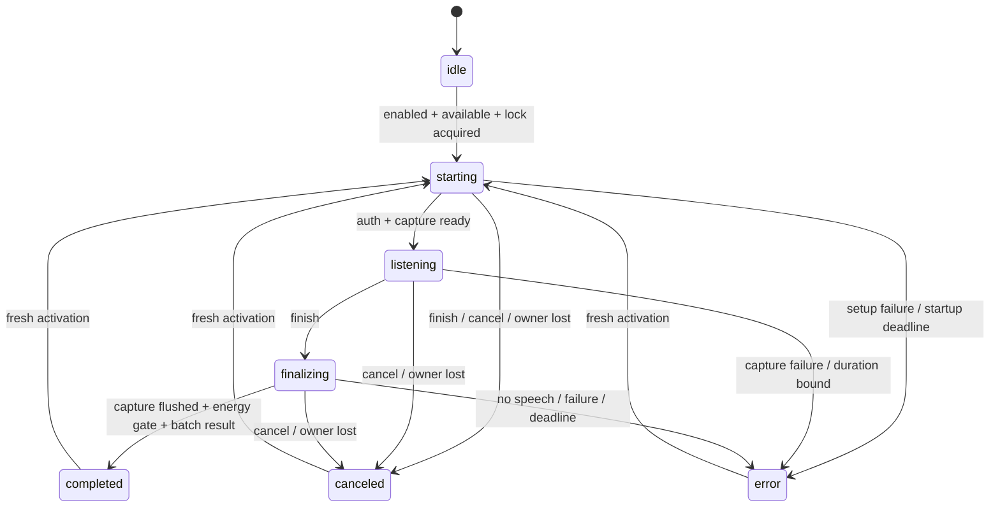

# Voice protocol v1

Voice support provides a portable batch session controller, a synthetic development harness,
a macOS capture adapter, and feature-gated composer dictation through the batch backend.
Production activation remains disabled. Composer dictation appends corrected text for manual
review and sending; shortcuts, popup review, and automatic submission are not enabled. See
[native capture](../native/voice/README.md) for build and IPC verification.

## Ownership and lifecycle

Create exactly one `VoiceController` (`@beaver/agent-core/voice/controller`) per application
instance. In Zotero, `Zotero.Beaver.voice` owns it in the plugin realm. Views subscribe and use
`projectVoice` to identify the originating window/output. Only `ownsOutput` may insert a result;
other mounted views observe the busy state. Outputs are immutable `{kind: "composer" | "draft",
id}` identities. The controller never writes editor or chat state.



Ready means setup succeeded, not that audio flowed. `audioStarted` becomes true on the first
valid frame, including silence. Silence never implies denied permission. Finishing while starting
cancels; late permission/setup results require fresh activation. `start()` returns the allocated
session ID, not a readiness guarantee. The snapshot remains authoritative if a synchronous
observer cancels before `start()` returns. Repeated finish/cancel and old-session commands are
harmless. Session IDs must be unique per activation.

The service accepts activation only from a focused window and cancels on that window's unload
or top-level blur. Internal focus movement is ignored. Logout/account replacement cancels,
including while authentication is unresolved. The expected user ID is required at activation;
resolved credentials must match. Same-user token refresh does not cancel. Credentials are
reacquired before upload, checked again against the same user, and never stored in public state
or passed to the native helper. Plugin shutdown disposes the service. System timers remain
active independently of window realms. Closing the last macOS window cancels its session
without destroying app-lifetime services.

## Capture and batch adapters

Factories synchronously return owned handles before asynchronous setup. They must not start
network work in their constructors. Capture `start()` emits `ready` with the format and resolves;
frames may follow readiness. `finish()` stops capture, flushes a possible short final frame, and
resolves only after all callbacks. No frame or quality event may follow its resolution.

The controller copies incoming PCM into a bounded private buffer. No audio leaves the plugin
while listening. On finish it releases capture, applies the duration/energy gate, refreshes auth,
and calls `VoiceTranscription.transcribe(recording, credential)` exactly once. `VoiceRecording`
contains the session envelope, format, total sample count, borrowed PCM, and immutable options.
The batch adapter compresses before its authenticated POST and returns the corrected
transcript. Codec, provider, and network details belong in that adapter, not native capture or
portable state. There is no transcription WebSocket, frame-send method, segment stream, or
separate completion acknowledgement.

`VoiceTranscript` returns `{version, sessionId, text}` or `{version, sessionId, error: {code}}`.
A valid result atomically sets `committedText` and completes the session. Empty text is valid and
must not trigger insertion/countdown/submission in consumers. While listening/finalizing there
is no provisional text. Wrong-session/version or malformed results fail; canceled sessions
ignore late promise settlements. Failed sessions have no partial transcript. Existing composer
text remains owned by the editor and must be preserved by the append-only editor integration.

`dispose()` is idempotent, even during setup. Capture revokes callbacks and stops its resources;
transcription aborts encoding/upload and releases all borrowed bytes. The controller revokes the
session first, clears timers, zeroes/releases its audio buffer, and disposes both handles even
if one throws. Adapters must release any derived encoded buffers on disposal and must not retain,
log, or persist audio by default. No transparent replay/reconnect is permitted.

## Activation options

`VoiceOptions` contains an explicit language (default `en`), provider bias terms, and a larger
correction vocabulary. The controller copies/freezes both arrays at activation; later selection
or preference changes cannot alter the utterance's context. Hosts must filter excluded libraries
before constructing these lists. Each list is bounded to 1,000 nonempty terms and 32,000 UTF-16
code units; adapters must apply their provider's smaller token/term budget. The Zotero collector selects relevant collection names, author names, distinctive reader-title
terms, and tags. It omits common title words and caps provider hints at 50 terms / 2,000 UTF-16
units; correction additionally receives title terms and journal titles within the core bounds.
The backend applies provider-specific limits and performs correction.
Options, credentials, vocabulary, and PCM are absent from snapshots and telemetry.

## Frames and quality

Every event has `{version: 1, sessionId}`. Capture frame sequences are zero-based and contiguous;
transcription has no segment identities or sequence counters. IPC adapters validate unknown
input, negotiate versions, and enforce bounds before decoding/allocating. Wrong-session capture
callbacks are ignored; a mismatched version fails the active session.

Audio is **16,000 Hz, mono, signed PCM16 little-endian** (`pcm_s16le`). `VoiceFrame` carries
`sequence`, `sampleCount`, `format`, and `pcm` (`Uint8Array`, two bytes/sample). Frames normally
contain 1,600 samples (100 ms). Finish permits one shorter, nonempty tail. Empty tails emit no
frame. Gaps, duplicates, wrong lengths/formats, early short frames, and frames after a short tail
are protocol errors. Native IPC keeps its own ordering, backpressure, and watchdogs.

`quality` capture events carry cumulative `inputPeak`, `clippedSamples` (input sample positions
where any channel approaches full scale), and `discontinuityCount`. Values must be finite,
nonnegative, and nondecreasing; counts must be safe integers. Snapshots expose immutable quality
and a session-latched `clipping` flag for warning UI. Counts remain available after termination
for content-free telemetry. A discontinuity can still fail capture; counting it does not authorize
silently dropping speech. Silence remains valid audio during capture.

The macOS converter downmixes and applies bounded gain before conversion. It preserves ordinary
speech levels, avoids boosting near-silence, caps quiet-speech amplification at 4×, and limits
peaks with headroom for resampling. Input clipping is measured before processing; already-clipped
microphone audio cannot be repaired. Audio sample timestamps detect missing/repeated input.
The development native harness exposes clipping recovery text and quality through `nativeState()`.

## Limits and energy gate

| Limit                                                  |                                             Value |
| ------------------------------------------------------ | ------------------------------------------------: |
| Frame samples / bytes                                  |                                     1,600 / 3,200 |
| Full recording buffer                                  |                       3,840,000 bytes (120 s PCM) |
| Authentication + capture startup                       |                                              30 s |
| Native finish + tail flush                             |                                              10 s |
| Auth refresh + compression + upload + corrected result |                                              30 s |
| Listening duration                                     |              120 s, also enforced by sample count |
| Minimum recording                                      |                            4,800 samples (300 ms) |
| Energy window                                          |                               320 samples (20 ms) |
| Required energy                                        | 3,200 samples (200 ms) in windows with RMS ≥ 0.01 |
| Final transcript                                       |                          64,000 UTF-16 code units |

Energy windows span frame boundaries and include complete windows in the final tail. The gate
rejects short, muted, near-silent, and isolated-click captures with `no_speech`, without invoking
transcription. RMS 0.01 is −40 dBFS. This is a conservative energy gate, not a speech classifier;
thresholds require real-microphone validation and cannot distinguish sustained noise from speech.
The 300 ms check is independent of the future keyboard hold threshold.

`VOICE_LIMITS` defines client bounds. Native and backend adapters independently enforce their
applicable bounds; client limits are not an authorization boundary. Recording past either duration
bound fails with `duration_limit`, without silently truncating or uploading a partial recording.

Errors contain named codes only: `disabled`, `unavailable`, `busy`, `unauthenticated`,
`permission_denied`, `device_unavailable`, `capture_failed`, `discontinuity`,
`insufficient_credits`, `source_ineligible`, `outcome_unknown`,
`transcription_failed`, `disconnected`, `protocol_error`, `overflow`, `startup_timeout`,
`finalization_timeout`, `transcription_timeout`, `duration_limit`, `no_speech`.

## Reproducible synthetic harness

Use a development build in a logged-in Zotero instance. The endpoint is absent in production
and rejects production invocation. The harness starts disabled and cannot open a microphone
or provider connection. Its synthetic owner makes HTTP tests independent of desktop focus;
service tests separately cover real-window lifecycle. Determine the actual port from worktree
metadata or `Zotero.Server.port`.

```sh
voice() {
  curl --fail -sS -X POST "http://127.0.0.1:$VOICE_HTTP_PORT/beaver/test/voice" \
    -H 'Content-Type: application/json' -d "$1"
}
voice '{"command":"enable","enabled":true}'
voice '{"command":"start"}'
voice '{"command":"state"}' # wait for listening
voice '{"command":"frame"}'
voice '{"command":"frame"}'
voice '{"command":"frame"}'
voice '{"command":"transcript","text":"A short voice test."}' # stages the fake response only
voice '{"command":"finish"}'
voice '{"command":"state"}' # completed: 4 frames, 5440 samples, 1 request, handles disposed
voice '{"command":"enable","enabled":false}'
```

`tests/fixtures/voice/session.json` is the handoff fixture. Fake frames contain a deterministic
440 Hz tone at amplitude 0.2, followed by a 640-sample tail. Fakes record request/sample counts
without retaining audio. Unit tests replay the fixture; live tests replay it through both Zotero
bundles and check that thread/run IDs remain unchanged. Nothing is submitted as chat.

```sh
npx vitest run tests/unit/voice
ZOTERO_HTTP_PORT="$VOICE_HTTP_PORT" npx vitest run --config vitest.live.config.ts tests/live/voice.live.test.ts
native/voice/macos/test.sh
npm run typecheck:core
npm run typecheck:ui
npm run check:bundle
npx tsc --noEmit
```

## Composer dictation

`voice.enabled` and `voice.nativeEnabled` both default to false. The composer microphone and
Settings language row are also compiled out of production builds (`NODE_ENV === "development"`).
With a development package installed, enable both prefs in Zotero's Config Editor under
`extensions.zotero.beaver`, then reload the plugin. Only macOS exposes the control; the packaged
installer enforces the supported OS/architecture/Zotero matrix. Signed distribution remains a
separate release requirement.

The first activation verifies/installs the packaged helper and performs permission-only setup.
The explanation identifies **Beaver Voice Input** and discloses audio/source-term upload and
separate Beaver credit usage. Grant access in the macOS prompt, then activate again to record.
Dictation also requires credits when chat uses a personal model key. Backend admission is
always authoritative. Settings → Advanced exposes the account-scoped spoken-language picker with fixed client choices. It defaults to English (`en`) and resets on account replacement. Legacy settings are normalized to a listed
code or fall back to English. Provider language support is enforced
by the backend.

While recording, the model picker and web-search toggle are replaced by a right-aligned graph
and sample-based elapsed timer. The graph starts empty. Add Sources and Send remain visible
and disabled. The editor remains editable, including command pills. Stop releases capture,
flushes the tail, and transcribes once. Escape cancels setup/capture/upload; it never sends.
The mic shows a spinner during setup and transcription. Low signal, clipping, permission,
device, credit, and transcription failures show recovery popups. Level warnings appear at most once per kind per recording.

The plugin assigns unique output identities across all React roots and window bundles. All
composers share capture/setup admission and send blocking. Only the still-mounted originating
composer can append a result, once, at the end of its current text. Appending preserves command
nodes. Completion attempts insertion immediately; only IME-delayed insertion is polled.
All composers keep Send and new dictation blocked until insertion or explicit discard. Closing/hiding the composer, changing the draft,
losing top-level focus, logout, or plugin unload revokes pending work. Initial permission setup
allows focus transfer, but does not start capture afterward.

Vocabulary is selected from activation-time context, independently of existing composer
attachments. Excluded libraries are filtered before metadata reads and rechecked after loading
and immediately before the POST. Source provenance follows the shared draft across mounted
composers and is checked again before manual sending. A new/reset draft clears that provenance.

## Batch upload

After dispatch, transport failures and unreadable or malformed results report `outcome_unknown`: the
backend may already have used credits. Pre-dispatch failures do not imply uncertain billing.

`src/services/voice/batchTranscription.ts` implements one authenticated
`POST /api/v1/voice/transcriptions` to the same configured API base URL as chat. It sends
`application/vnd.beaver.voice.v1`, with no HTTP Content-Encoding:

1. Four-byte unsigned big-endian metadata length.
2. UTF-8 JSON: `version`, UUID `session_id`, `language`, `encoding: "pcm16le-gzip"`,
   `sample_rate: 16000`, `channels: 1`, `biasTerms`, and `correctionVocabulary`.
3. Exactly one gzip member containing the PCM, including the final short tail.

Compression uses the bundled pako encoder in bounded 64 KiB input steps, yielding between
steps for cancellation. Metadata is capped at 400,000 bytes, compressed audio at 3,850,000,
and PCM at 3,840,000. Derived byte buffers are zeroed on settlement/disposal. At maximum size,
PCM, compressed chunks, and the envelope together account for under 12 MiB, plus bounded
encoder state and metadata. This is an allocation bound, not a whole-process memory benchmark.
Web APIs are imported into the plugin realm; uploads do not borrow an unrelated window's realm.

The response reader caps bytes before JSON parsing. Success requires the matching session UUID,
a nonblank corrected transcript of at most 64,000 UTF-16 units, the expected decoded duration,
and a finite nonnegative credit cost. Structured backend errors are mapped to fixed client codes.
There is no request retry, credential replay, new-ID retry, or fallback to an uncorrected result.
Cancellation aborts compression/upload; late responses cannot update an editor.

`Zotero.Beaver.voice.diagnostics()` exports only fixed-size timing, captured duration/frame
count, phase/error code, and quality counters for the most recent session. It never includes
audio, transcript, vocabulary, account identity, or credentials, and is not persisted.

## Integration verification

With an isolated, logged-in development instance and both voice flags enabled:

```sh
npx vitest run tests/unit/voice tests/unit/utils/lexicalReactivation.test.ts
ZOTERO_HTTP_PORT=<worktree-http-port> npx vitest run --config vitest.live.config.ts tests/live/voice.live.test.ts
python3 native/voice/tests/zotero-dictation.py
python3 native/voice/tests/zotero-dictation.py --surface window
# Open a reader tab before running:
python3 native/voice/tests/zotero-dictation.py --surface reader
```

The Python test starts a loopback-only validating endpoint with a dummy credential. It verifies
the mounted composer, packaged helper installation, actual gzip POST, footer states, concurrent
editing, one insertion/POST on Stop, and no POST on Escape. Capture and desktop focus are
explicitly stubbed and restored afterward; no microphone audio or provider request is made.
All three surfaces passed the mounted-composer checks in a local development profile,
including cancellation on close and sidebar reopen without resuming capture.
The full unit regression passed 7,019 tests (3 existing skips), and the live fake-session
suite passed all 3 tests. Native converter checks, development build/package gates, and
changed-file lint also passed. Physical microphone and provider acceptance remain pending.

The UI test writes a cropped composer screenshot to the system temporary directory. Run it only in an
isolated test profile; it temporarily edits and restores the current editor state.

Local Zotero measurements for synthetic incompressible PCM (encoding + loopback POST + fake
response, excluding native stop/auth/provider work): 340 ms of audio: 2 ms / 10,903 gzip bytes;
20 seconds: 45 ms / 640,218 bytes; 120 seconds: 259 ms / 3,841,193 bytes. A compressible
20-second tone took 18 ms. These are local development measurements, not provider latency
or microphone-quality results.

For the first real backend test, use the same API base URL and Supabase project/account as
chat, enable the backend voice service, apply its required credit/session migrations, configure
the selected transcription/correction providers and pricing, and ensure the account has usable
credits. Build/install the development helper package, grant microphone permission, and start
with a short spoken sentence. Type additional text while recording, press Stop, review the
appended correction, and send manually only if desired. Physical speech accuracy, provider
latency, permission allow/deny/retry, microphone/device loss, and signed-distribution acceptance
require separate manual checks; fake tests do not establish those properties.
